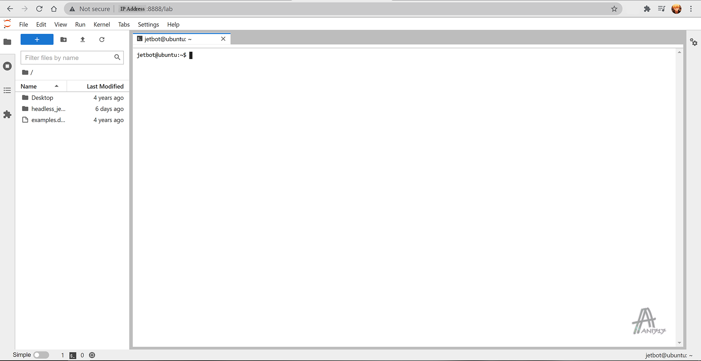

<p align="center">
  <h1 align="center">Headless Jetson Nano Setup for Jetbot Build</h1>
</p>

<p align="justify">
Headless Jetson Nano 4GB setup with with Micro-USB cable Without Using Monitor. USB Dongle is required for Wifi Connection. JupyterLab setup included. JupyterLab doesn't need docker. Torch, Torch2trt, ONNX, ONNXRuntime-GPU Torchvision and TensorFlow Installation Included. ROS2 Dasing Installation Included.
</p>
  
## Colaborators
[Animesh Bala Ani](https://www.linkedin.com/in/ani717/)

## Table of Contents
* [Install Jetson Nano Image](#install) <br/>
* [Boot Jetson Nano](#boot) <br/>
* [Wifi Connection Setup](#wifi) <br/>
* [Download This Repository](#repository) <br/>
* [One Command Install All](#all) <br/>
* [Enable I2C Permissions](#i2c) <br/>
* [Install Jupyter Lab](#jupytarlab) <br/>
* [Setup Jetbot Stats](#stats) <br/>
* [Install ROS2 Dashing](#ros2dashing) <br/>
* [Install Torch](#torch) <br/>
* [Install Torch2trt and ONNX](#torch2trt) <br/>
* [Install TensorFlow](#tf) <br/>
* [Issues](#issue) <br/>

## Install Jetson Nano Image <a name="install"></a>
Download [balenaEtcher](https://www.balena.io/etcher/) and install it.</br>
Download [Jetson Nano Developer Kit SD Card Image](https://developer.nvidia.com/jetson-nano-sd-card-image-45-0), and write it on a microSD card with **balenaEtcher**.</br>

## Boot Jetson Nano <a name="boot"></a>
Insert the microSD card to Jetson Nano.</br>
Connect Jetson Nano with a PC/Laptop using Micro-USB cable.</br>
Power On the Jetson Nano and wait for 1-2 minutes.</br>
Download [PuTTY](https://www.putty.org/).<br/>
Open **Putty**, select connection type **serial**.<br/>
The serial line value `COM#` can be found from following in Windows OS.</br>
```
Device Manager > Ports (COM&LPT) > USB Serial Device (COM#)
```
Once connected, go through initial setup until Network Configuration.</br>
Select `dummy0: Unknown Interface`</br>
Once it fails to connect, select `Do not configure the network at this time`</br>
Go through the rest of the steps with the default settings.
Once completed, wait couple of minutes and go to next step.

## Wifi Connection Setup <a name="wifi"></a>
Open Putty and connect using host name `192.168.55.1` or using COM Port<br/>
Run following command and reboot Jetson Nano.</br>
```
sudo systemctl restart network-manager.service
```
Log into Jetson Nano and run following command to detect availability of your wifi SSID.</br>
```
nmcli device wifi list
```
Connect to wifi using following command.</br>
```
sudo nmcli device wifi connect <SSID> password <Wifi_Password>
```
Run following command to get the IP address (2nd one).</br>
```
hostname -I
```
Open Putty and connect using the IP address.<br/>
Once login completes, the Micro-USB cable can be disconnected.

## Download Repository <a name="repository"></a>
```
git clone https://github.com/ANI717/Headless-Jetson-Nano-Setup
```

## One Command Install All <a name="all"></a>
Installs `Jupyter Lab`, `ROS2 Dashing`, `PyTorch`, `Torchvision`, `Torch2trt`, `ONNX` and `ONNX Runtime`.<br/>
Enable I2C Permissions.<br/>
Sets Jetbot Stats.<br/>
Takes aroud 20 minutes to 50 minutes.<br/>
```
cd ~/Headless-Jetson-Nano-Setup
chmod +x ./*.sh && ./install.sh
```

## Enable I2C Permissions <a name="i2c"></a>
```
sudo usermod -aG i2c $USER
```

## Install Jupyter Lab <a name="jupytarlab"></a>
```
cd ~/Headless-Jetson-Nano-Setup
chmod +x ./jupyter.sh && ./jupyter.sh
```
Open Jupytar Lab in a browser with `<IP Address>:8888` link. Default password is `jetbot`.<br/> 
The interface should look like this (without watermark).<br/>

<br/>
[Reference](https://github.com/NVIDIA-AI-IOT/jetbot/wiki/Create-SD-Card-Image-From-Scratch)

## Setup Jetbot Stats <a name="stats"></a>
Setup Jetbot Stats Service to show Jebot status in OLED display.<br/>
```
cd ~/Headless-Jetson-Nano-Setup
chmod +x ./jetbot_stats.sh && ./jetbot_stats.sh
```

## Install ROS2 Dashing <a name="ros2dashing"></a>
```
cd ~/Headless-Jetson-Nano-Setup
chmod +x ./dashing.sh && ./dashing.sh
```
[Reference](https://docs.ros.org/en/dashing/Installation/Ubuntu-Install-Debians.html)

## Install Torch <a name="torch"></a>
Installs `PyTorch` and `TorchVision`.<br/>
```
cd ~/Headless-Jetson-Nano-Setup
chmod +x ./pytorch.sh && ./pytorch.sh
```
[PyTorch Wheel](https://forums.developer.nvidia.com/t/pytorch-for-jetson-version-1-9-0-now-available/72048)<br/>

## Install Torch2trt and ONNX <a name="torch2trt"></a>
Installs `Torch2trt`, `ONNX` and `ONNXRuntime-GPU`.<br/>
```
cd ~/Headless-Jetson-Nano-Setup
chmod +x ./torch2trt_onnx.sh && ./torch2trt_onnx.sh
```

## Install TensorFlow <a name="tf"></a>
Installs `TensorFLow`.<br/>
```
cd ~/Headless-Jetson-Nano-Setup
chmod +x ./tensorflow.sh && ./tensorflow.sh
```

## Issues <a name="issue"></a>
Installing or modifying `OpenCV` will break `Gstreamer Pipeline`.<br/>
Therefore `Albumation` package should not be installed for Deep Learning.<br/>
Also `Numpy` version `1.19.4` is required to work `Gstreamer Pipeline`.<br/>

Updating `Setuptools` will generate deprication error during ROS2 workspace building.<br/>

